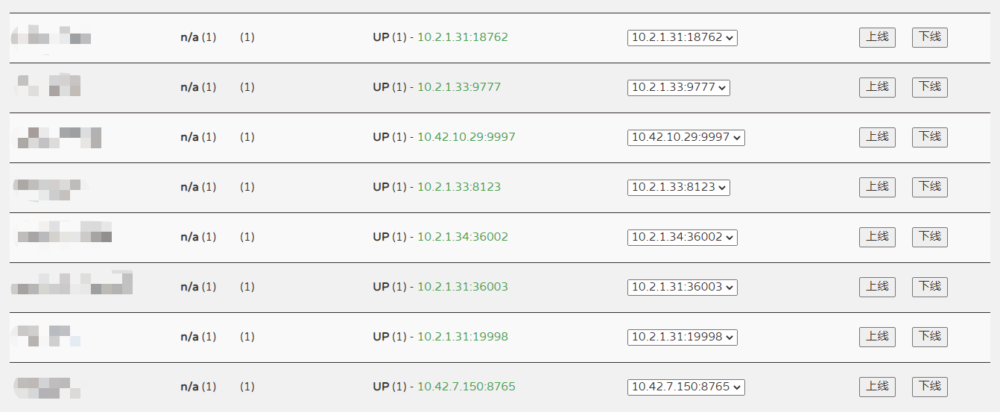
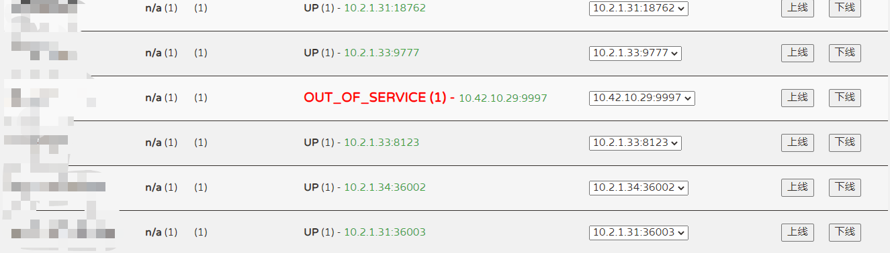

# eureka_script
>  eureka上下线tampermonkey脚本
>
> 为eureka添加`上线`和`下线`按钮

```javascript
// ==UserScript==
// @name         Eureka注册中心上下线
// @namespace    http://tampermonkey.net/
// @version      0.1
// @description  try to take over the world!
// @author       huangxd
// @match        http://注册中心IP:端口/
// @require      https://cdn.bootcss.com/jquery/3.4.1/jquery.min.js
// @grant        none
// ==/UserScript==
(function () {
    'use strict';

    var href = window.location.href;

    window.onload = function () {
        $("table#instances thead tr th:last").after("<th>操作</th>").after("<th>实例列表</th>");
        $("table#instances:eq(2) tbody").children().each(function (index, element) {
            var option = ""
            $(this).children("td:last").children("a").each(function () {
                var item = $(this).text();
                console.log(item)
                if (item.length > 7) {
                    option += "<option value=" + item + ">" + item + "</option>"
                }
            })
            var instanceName = $(this).children("td:first").text();
            console.log("实例名称: " + instanceName);
            $(this).children("td:last").after("<td><button style='margin: 10px 10px;' class='index-" + index + "' onclick='window.upService(this,&quot;" + instanceName + "&quot;)'>上线</button><button style='margin: 10px 10px;' class='index-" + index + "' onclick='window.outOfService(this,&quot;" + instanceName + "&quot;)'>下线</button></td>").after("<td><select class='index-" + index + "'>" + option + "</select></td>");
        });


    }
    //服务上线
    //格式: x.x.x.x:xxxx/eureka/apps/实例名称/IP地址/status?value=UP
    window.upService = function (element, instanceName) {
        var classBtn = $(element).attr("class");
        var ele = "select." + classBtn;
        var ip = $(ele).val();
        console.log("实例IP: " + ip);
        var urlString = href + "eureka/apps/" + instanceName + "/" + ip + "/status?value=UP";
        console.log("请求地址: " + urlString);
        var confirmFlag = confirm(instanceName + "\n" + ip + "\n服务下线确认");
        if (confirmFlag) {
            $.ajax({
                type: 'PUT',
                url: urlString,
                success: function (data) {
                    alert(instanceName + "\n" + ip + "\n上线成功");
                },
                error: function (data) {
                    alert(instanceName + "\n" + ip + "\n上线异常");
                }
            });
            window.location.reload();
        }
    }

    //服务下线
    //格式: x.x.x.x:xxxx/eureka/apps/实例名称/IP地址/status?value=OUT_OF_SERVICE
    window.outOfService = function (element, instanceName) {
        var classBtn = $(element).attr("class");
        var ip = $("select." + classBtn).val();
        console.log("实例IP: " + ip);
        var urlString = href + "eureka/apps/" + instanceName + "/" + ip + "/status?value=OUT_OF_SERVICE";
        console.log("请求地址: " + urlString);
        var confirmFlag = confirm(instanceName + "\n" + ip + "\n服务下线确认");
        if (confirmFlag) {
            $.ajax({
                type: 'PUT',
                url: urlString,
                success: function (data) {
                    alert(instanceName + "\n" + ip + "\n下线成功");
                },
                error: function (data) {
                    alert(instanceName + "\n" + ip + "\n下线异常");
                }
            });
            window.location.reload();
        }

    }
})();
```

# 效果图



<br>

